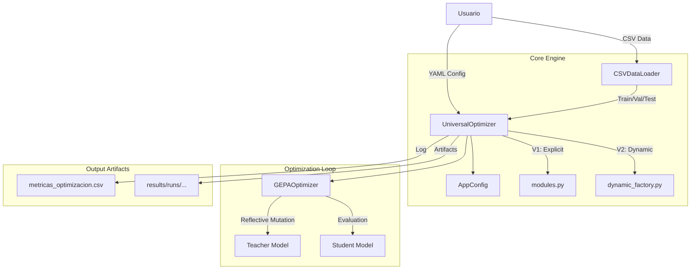

# Arquitectura de Integración DSPy + GEPA (Implementada)

## Propósito del Documento
Este documento es la Fuente Única de Verdad (SSOT) para la arquitectura de integración entre el framework DSPy y el optimizador GEPA en el proyecto Reflexio Dicta. Describe la implementación final que combina la modularidad de DSPy con la metodología de producción de GEPA Standalone.

---

## 1. Visión General de la Arquitectura

El sistema implementa una arquitectura híbrida que soporta dos modos de operación, ambos gestionados por un **Orquestador Universal**.

### Diagrama de Alto Nivel



---

## 2. Modos de Operación

### Modo V1: Explícito (Python-Defined)
Ideal para lógica compleja, pipelines multi-paso o validaciones personalizadas.
- **Definición:** Las `Signatures` y `Modules` se escriben como clases Python en `dspy_gepa_poc/modules.py`.
- **Configuración:** El YAML solo referencia el `type` del módulo (ej: `sentiment`, `extractor`).
- **Ventaja:** Control total sobre la lógica de `forward()`.

### Modo V2: Dinámico (Zero-Code / YAML-Defined)
Ideal para prototipado rápido y tareas estándar (Clasificación, Extracción simple).
- **Definición:** La `Signature` (instrucción, inputs, outputs) se define enteramente en el archivo YAML.
- **Configuración:** `type: "dynamic"`.
- **Ventaja:** No requiere escribir ni una línea de código Python.

---

## 3. Estructura del Proyecto

```
dspy_gepa_poc/
├── configs/            # Configuración Declarativa (YAML)
│   ├── sentiment_config.yaml       # Ejemplo V1
│   └── dynamic_sentiment.yaml      # Ejemplo V2
├── datasets/           # Fuente de Verdad de Datos (CSV)
│   ├── sentiment.csv
│   └── extraction.csv
├── results/            # Salidas Estructuradas
│   ├── experiments/    # Log Maestro (metricas_optimizacion.csv)
│   └── runs/           # Artefactos por ejecución
├── adapters/           # (Reservado para lógica custom futura)
├── config.py           # Sistema de Configuración (AppConfig)
├── config_schema.py    # Validación Estricta de YAML
├── data_loader.py      # Carga de CSVs a DSPy Examples (Train/Val/Test)
├── dynamic_factory.py  # Generador de Clases DSPy al vuelo (V2)
├── metrics.py          # Métricas de Evaluación
├── modules.py          # Definiciones Estáticas (V1)
├── optimizer.py        # Wrapper de GEPA
├── results_logger.py   # Gestión del Log Maestro
└── reflexio_declarativa.py # Punto de Entrada Principal
```

---

## 4. Metodología de Datos (3 Conjuntos)

El sistema impone estrictamente la metodología de 3 conjuntos para garantizar validez científica, idéntica a `gepa_standalone`.

| Split | Rol | Descripción |
| :--- | :--- | :--- |
| **train** | Optimización | Usado por GEPA para proponer candidatos y reflexionar sobre errores. |
| **val** | Selección | Usado para puntuar candidatos y seleccionar el mejor de la frontera de Pareto. |
| **test** | Robustez | Usado **una sola vez** al final para evaluar el rendimiento real del modelo optimizado. |

**Formato CSV Requerido:**
```csv
split,text,sentiment,...
train,"Ejemplo 1","positive",...
val,"Ejemplo 2","negative",...
test,"Ejemplo 3","neutral",...
```

---

## 5. Configuracion (YAML)

El sistema utiliza configuracion declarativa validada por esquema. Los archivos YAML se ubican en `dspy_gepa_poc/configs/`.

Para la referencia completa de todos los campos disponibles, ver **`docs/YAML_CONFIG_REFERENCE.md`** (seccion 1: DSPy + GEPA).

Los ejemplos funcionales se encuentran en `dspy_gepa_poc/configs/`.

---

## 6. Salidas y Resultados

### Log Maestro
Ubicación: `dspy_gepa_poc/results/experiments/metricas_optimizacion.csv`
Formato: CSV Europeo (separador `;`, decimal `,`).
Compatible con: Herramientas de `ROI Calculator` y `Leaderboard` de GEPA Standalone.

**Columnas:**
- Run ID (UUID)
- Fecha
- Caso
- Modelo Tarea / Profesor
- Scores (Baseline, Optimizado, Robustez)
- Directorio del Run

### Artefactos por Ejecución
Ubicación: `dspy_gepa_poc/results/runs/<Case_Name>_<Timestamp>/`
Contenido:
- `optimized_program.json`: El módulo DSPy compilado y listo para producción.
- `config_snapshot.yaml`: Copia exacta de la configuración usada.

---

## 7. Flujo de Trabajo Típico

1.  **Preparar Datos:** Subir archivo `.csv` a `dspy_gepa_poc/datasets/`.
2.  **Configurar:** Crear un archivo `.yaml` en `dspy_gepa_poc/configs/`.
3.  **Ejecutar:**
    ```bash
    python dspy_gepa_poc/reflexio_declarativa.py --config dspy_gepa_poc/configs/mi_experimento.yaml
    ```
4.  **Analizar:** Revisar `metricas_optimizacion.csv` o los logs de consola.
5.  **Desplegar:** Tomar `optimized_program.json` para uso en producción.

---

## 8. Inferencia y Uso en Producción

El sistema incluye un motor de inferencia genérico que permite consumir los resultados de la optimización sin necesidad de re-ejecutar GEPA ni utilizar el modelo de reflexión (Teacher).

### Ejecución de Inferencia
Ubicación: `dspy_gepa_poc/run_inference.py`

Este script es **completamente agnóstico a la tarea** y reconstruye el entorno de ejecución basándose en los artefactos de la carpeta de ejecución (`run`).

```bash
python dspy_gepa_poc/run_inference.py dspy_gepa_poc/results/runs/<NOMBRE_DEL_RUN>/
```

### Características del Motor de Inferencia
- **Carga Dinámica:** Lee el `config_snapshot.yaml` para reconstruir la `Signature` y la arquitectura del módulo DSPy automáticamente.
- **Inyección de Pesos:** Carga el `optimized_program.json` (que contiene los prompts refinados y los mejores ejemplos few-shot encontrados) sobre el modelo estudiante.
- **Eficiencia de Costos:** Solo requiere configurar el `LLM_MODEL_TASK`. No utiliza el modelo de reflexión, lo que reduce drásticamente el consumo de tokens y la latencia.
- **Interfaz Adaptable:** Detecta automáticamente los campos de entrada y salida definidos en el YAML original para presentarlos en un loop interactivo de consola.

### Flujo de Integración Externa
Para integrar un modelo optimizado en una aplicación propia, solo se requiere:
1. Inicializar DSPy con el modelo estudiante.
2. Recrear la `Signature` (o usar `DynamicModuleFactory`).
3. Ejecutar `module.load("path/to/optimized_program.json")`.