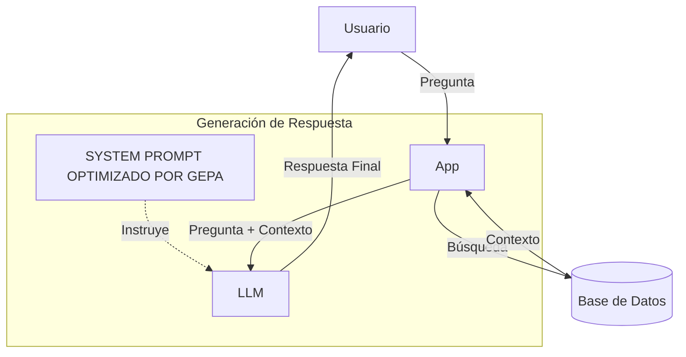

# Guía Demo 4: Optimización de Sistema RAG (Corporate Policies)

Este documento detalla el caso de uso implementado en `demos/demo4_rag_optimization.py`, diseñado para demostrar cómo GEPA puede optimizar sistemas de **Generación Aumentada por Recuperación (RAG)** utilizando evaluación basada en modelos (LLM-as-a-Judge).

## 1. El Escenario de Negocio

Estamos simulando un bot de **Soporte Interno de RRHH y Gastos**.
*   **Contexto**: Políticas corporativas sobre viajes, trabajo remoto, vacaciones y gastos.
*   **Problema**: Los modelos genéricos a veces "alucinan" (inventan reglas que no existen) o son demasiado vagos, no ciñéndose estrictamente a la política recuperada.
*   **Objetivo**: Lograr que el modelo responda **exactamente** lo que dice la política, sin añadir información externa ni omitir restricciones clave (ej. límites de gastos).

**Nota técnica**: Este demo **simula** la fase de recuperación usando contextos pre-cargados en el dataset CSV. Para RAG real con vector stores (ChromaDB, Weaviate, Qdrant, etc.), consulta la implementación completa en la librería GEPA.

## 2. Arquitectura de la Solución

A diferencia de los demos de clasificación (donde la respuesta es correcta/incorrecta), aquí la evaluación es subjetiva. Por ello utilizamos el patrón **LLM-as-a-Judge**:

1.  **Input**: Pregunta + Contexto (Política recuperada).
2.  **Generador (Student)**: El modelo que estamos optimizando (ej. GPT-4o-mini). Genera una respuesta.
3.  **Evaluador (Teacher/Judge)**: Un modelo más potente (ej. GPT-4o). Compara la respuesta generada con la respuesta ideal (Ground Truth).

### ¿En qué se diferencia optimizar RAG de un Prompt normal?

| Característica | Optimización de Prompt (Demo 1) | Optimización de RAG (Demo 4) |
| :--- | :--- | :--- |
| **Enemigo Principal** | Mala lógica o formato. | **Alucinación** y uso de conocimiento externo. |
| **Fuente de Verdad** | Conocimiento interno del modelo. | **Contexto externo** (Políticas). |
| **Meta de GEPA** | Que el modelo razone mejor. | Que el modelo **obedezca** y se ciña al texto. |
| **Evaluación** | Determinista (Exact Match). | **Semántica (Juez LLM)**. |

En el Demo 4, GEPA no enseña al modelo a "saber más", sino a ser **más riguroso** con la información proporcionada y a ignorar sus propios sesgos si contradicen la política corporativa.

### Criterios del Juez
El juez evalúa usando **cinco valores discretos** (0.0, 0.25, 0.5, 0.75, 1.0) basándose en:
*   **Precisión Factual**: ¿Los hechos son correctos según el contexto?
*   **Completitud**: ¿Incluye detalles críticos (números, condiciones, excepciones)?
*   **Alucinación**: ¿Inventa información no presente en el contexto?
*   **Relevancia**: ¿Responde exactamente lo preguntado?

Escala de puntaje (mayor granularidad para mejor sensibilidad):
*   **1.0**: Perfecta - todos los detalles críticos, sin alucinaciones
*   **0.75**: Buena - correcta pero omite detalle menor
*   **0.5**: Parcial - correcta en esencial pero falta info clave
*   **0.25**: Pobre - mayormente incorrecta o alucinaciones significativas
*   **0.0**: Fallida - completamente incorrecta o no responde

## 3. Componentes

| Componente | Archivo | Descripción |
| :--- | :--- | :--- |
| **Script** | `demos/demo4_rag_optimization.py` | Orquestador del experimento. |
| **Adaptador** | `adapters/simple_rag_adapter.py` | Contiene la lógica del "Juez" y el cálculo de métricas. |
| **Dataset** | `experiments/datasets/rag_qa.csv` | 15 ejemplos desafiantes (9 train, 4 val, 2 test). Incluye 5 categorías: Inferencia Numérica, Ambigüedad, Anti-Alucinación, Multi-Hop, Detalles Críticos. |
| **Prompt** | `experiments/prompts/rag.json` | Prompt inicial con anti-pattern que invita a usar "conocimiento general" (causará alucinaciones). |

### Parámetros Técnicos

| Parámetro | Valor | Justificación |
| :--- | :--- | :--- |
| **Temperature** | 0.0 | Evaluación determinista (task y judge) |
| **Max Tokens (Generación)** | 400 | Respuestas detalladas con múltiples condiciones |
| **Max Tokens (Juez)** | 200 | Feedback detallado con escala de 5 puntos |
| **Presupuesto GEPA** | 60 llamadas | Balance entre costo y calidad de optimización |
| **RAG Context Max Length** | 500 | Límite de contexto en dataset reflexivo (configurable en `.env`) |
| **RAG Max Positive Examples** | 2 | Ejemplos exitosos en dataset reflexivo (configurable en `.env`) |

**Ejemplo de configuración personalizada:**
```bash
# En .env - Para políticas más largas
RAG_CONTEXT_MAX_LENGTH=2000
```

## 4. Ejecución y Resultados Esperados

Para correr el demo:
```bash
python gepa_standalone/demos/demo4_rag_optimization.py
```

### ¿Por qué el dataset de RAG es más pequeño (6 casos)?

A diferencia de otros demos que tienen 50 o 100 ejemplos, el Demo 4 utiliza un set reducido por tres razones estratégicas:

1.  **Costo y Tiempo del Juez LLM**: En RAG, cada evaluación invoca a un segundo LLM (el Juez). Evaluar 100 casos en cada iteración de GEPA sería extremadamente lento y costoso. Un set pequeño permite iterar rápidamente.
2.  **Complejidad del Dato**: Crear triplas de (Pregunta, Contexto, Respuesta Ideal) requiere una curación manual cuidadosa para asegurar que la respuesta esté realmente contenida en el contexto.
3.  **Filosofía de Reflexión**: GEPA no necesita volumen masivo de datos; necesita **errores significativos**. Un solo error bien explicado por el Juez (ej. "Olvidaste mencionar que se requiere aprobación del VP") es suficiente para que GEPA generalice la regla en el prompt para miles de casos similares. Necesitamos  casos "borde".

### Fase 1: Baseline
El sistema evalúa el prompt inicial: *"Eres un asistente útil. Responde la pregunta..."*.
*   **Resultado típico**: Score ~0.6 - 0.8.
*   **Fallas comunes**: El modelo puede ser muy verboso o perder detalles finos (ej. topes de reembolso).

### Fase 2: Optimización (GEPA Loop)
GEPA iterará proponiendo nuevos prompts basados en el feedback del Juez.
*   *Feedback del Juez*: "La respuesta omitió el límite de $80 para viajes internacionales."
*   *Reflexión de GEPA*: "Debo modificar el prompt para que enfatice la atención a los detalles numéricos y límites en el contexto."

### Fase 3: Resultado Final
Se espera obtener un prompt especializado que instruya al modelo a ser riguroso con los datos del contexto.
*   **Score Esperado**: ~0.9 - 1.0.
*   **Salida**: Un prompt más complejo, tipo: *"Eres un experto en políticas. Tu prioridad es la precisión. Si el contexto menciona límites monetarios, debes incluirlos explícitamente..."*

## 5. Interpretación de la Salida

En la consola verás bloques como este durante la validación:

```text
[-] Puntaje: 0.5
    Gen: Se requieren recibos para los gastos.
    Ref: No, solo se requieren recibos para montos superiores a $25.
    Juez: La respuesta generada es parcialmente correcta pero engañosa. Omite la condición clave de "montos superiores a $25".
```

Esto demuestra el poder del feedback textual: GEPA entiende *por qué* falló y lo corrige en la siguiente iteración.

## 6. Integración en Producción

El resultado final de este demo es un **texto** (el System Prompt optimizado). Para usarlo en tu aplicación real (chatbot, buscador, etc.), debes copiar este texto y colocarlo en la llamada a tu LLM.

### Diagrama de Integración



Tu código de producción se vería así:

```python
# Este es el texto que ganaste en el Demo 4
SYSTEM_PROMPT_OPTIMIZADO = """
Eres un analista experto en políticas. Tu prioridad es la precisión factual.
Reglas:
1. Si el contexto menciona límites monetarios, cítalos explícitamente.
2. Si la respuesta no está en el contexto, responde "No tengo información".
...
"""

# Llamada en tiempo real
response = client.chat.completions.create(
    model="gpt-4o-mini",
    messages=[
        {"role": "system", "content": SYSTEM_PROMPT_OPTIMIZADO},  # <--- TU RESULTADO
        {"role": "user", "content": f"Contexto: {docs}\nPregunta: {query}"}
    ]
)
```

---

## Configuración Avanzada: Ejemplos Positivos (Sprint 2)

### Variable de Entorno

```bash
# En .env
RAG_MAX_POSITIVE_EXAMPLES=2  # Default recomendado
```

### Qué Hace

Controla cuántos ejemplos **exitosos** (score 1.0) se incluyen en el feedback reflexivo que GEPA usa para optimizar.

**Sin positivos (0):** GEPA solo ve errores → Aprende "evitar X, Y"
**Con positivos (2):** GEPA ve errores Y éxitos → Aprende "evitar X, hacer como Y"

### Valores Recomendados

| Dataset | Valor | Razón |
|---------|-------|-------|
| 6-10 ejemplos | 1 | Mínimo refuerzo positivo |
| 11-20 ejemplos | **2** | Balance óptimo (default) |
| 21-30 ejemplos | 3 | Más contexto |
| 30+ ejemplos | 5 | Mayor variedad |

**Regla:** Máximo 20% del dataset reflexivo debe ser positivo

### Formas de Uso

```python
# 1. Default (usa .env o Config: 2)
adapter = SimpleRAGAdapter()

# 2. Override explícito
adapter = SimpleRAGAdapter(max_positive_examples=3)

# 3. Sin positivos (solo errores)
adapter = SimpleRAGAdapter(max_positive_examples=0)
```

### Verificación

Durante la ejecución, verás:
```
[INFO] Dataset reflexivo: 6 negativos, 2 positivos
```

### Experimentación

Compara resultados con diferentes valores:

```bash
# Run 1: Sin positivos
RAG_MAX_POSITIVE_EXAMPLES=0 python gepa_standalone/demos/demo4_rag_optimization.py

# Run 2: Default (2 positivos)
python gepa_standalone/demos/demo4_rag_optimization.py

# Run 3: Más positivos
RAG_MAX_POSITIVE_EXAMPLES=5 python gepa_standalone/demos/demo4_rag_optimization.py
```

Analiza métricas: baseline, optimized, mejora, y si el prompt cambió.
